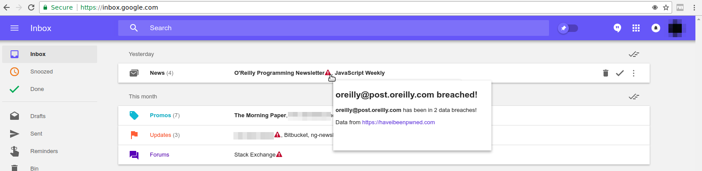

# gmail-pwned
A chrome extension to see if a received email comes from an address that's been in a data breach. Uses the [haveibeenpwned.com](http://haveibeenpwned.com) API.

## Overview
Adds a small icon next to email addresses that have been in a data breach. 
Hovering over the icon shows additional information about the breaches that the email address is found in.

## Installation
1. `git clone` this repository
2. Access `chrome://extensions` in Chrome
3. Tick the `developer mode` checkbox
4. Click `Load unpacked extension...`
5. Select the `ext` folder in this repository
6. Have fun!

This extension will (eventually) be in the Chrome Web Store.
